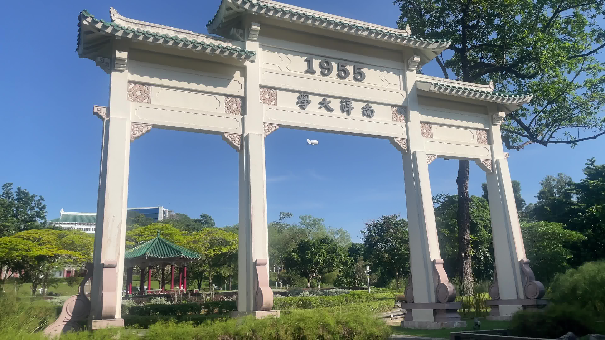
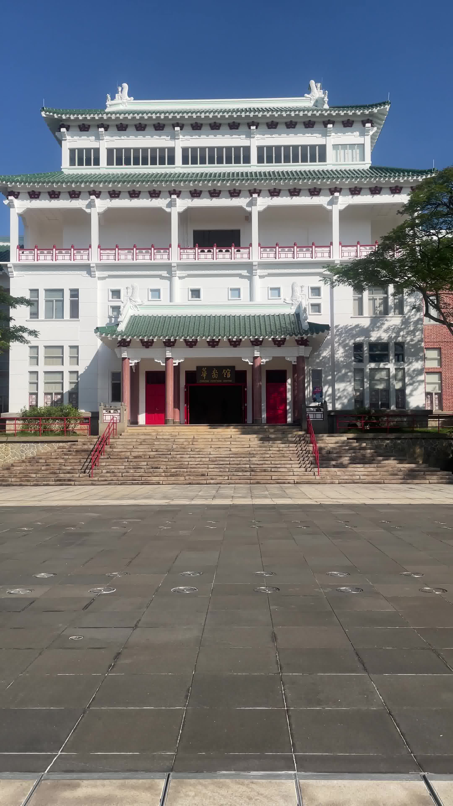
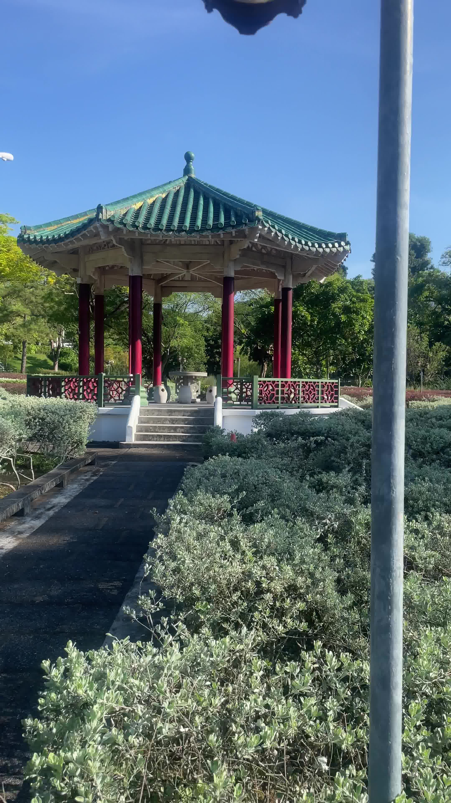

# Computer Vision Project - 3D Scene Reconstruction

This project implements a complete computer vision pipeline for 3D scene reconstruction using Structure from Motion (SfM) techniques.

## 📁 Project Structure

```
project/
├── calibration/                    # Camera calibration
│   ├── calibrate_camera.py        # Camera calibration script
│   ├── frames/                    # Extracted calibration frames
│   └── results/
│       ├── iphone_calibration.npz # Camera calibration parameters
│       └── undistort_sample.jpg   # Undistortion example
├── scenes/                        # Scene data
│   └── images/                   # Extracted frames
│       ├── arch/                 # 126 frames (2fps)
│       ├── chinese_heritage_centre/ # 154 frames (2fps)
│       ├── pavilion/             # 193 frames (2fps)
└── feature_extraction/            # Feature extraction
    ├── extract_features_batch.py # Batch processing script
    └── features/                 # Extracted features
        ├── arch/                 # 252 feature files (126 keypoints + 126 descriptors)
        ├── chinese_heritage_centre/ # 308 feature files (154 keypoints + 154 descriptors)
        └── pavilion/            # 386 feature files (193 keypoints + 193 descriptors)
```

## 🎯 Scenes Captured

### 1. Arch Scene
- **Frames**: `scenes/images/arch/` (126 images at 2fps)
- **Features**: `feature_extraction/features/arch/`



### 2. Chinese Heritage Centre Scene
- **Frames**: `scenes/images/chinese_heritage_centre/` (154 images at 2fps)
- **Features**: `feature_extraction/features/chinese_heritage_centre/`



### 3. Pavilion Scene
- **Frames**: `scenes/images/pavilion/` (193 images at 2fps)
- **Features**: `feature_extraction/features/pavilion/`



## 📷 Camera Calibration

**Calibration File**: `calibration/results/iphone_calibration.npz`

This file contains:
- **Camera Matrix (K)**: Intrinsic parameters (focal length, principal point)
- **Distortion Coefficients**: Lens distortion correction parameters
- **Image Size**: Original image dimensions

**Usage**: The calibration is automatically applied during feature extraction and 3D reconstruction for undistorted, accurate results.

## 🔧 Feature Extraction

### SIFT Features
- **Detector**: SIFT (Scale-Invariant Feature Transform)
- **Descriptor**: 128-dimensional feature vectors
- **Undistortion**: Applied using camera calibration
- **Output Format**: 
  - `*_keypoints.npy`: Keypoint coordinates, scale, angle, response, octave, class_id
  - `*_descriptors.npy`: 128-dimensional SIFT descriptors
  - `feature_summary.csv`: Statistics for each image
  - `viz/`: Visualization images with keypoints drawn

### Feature Statistics
| Scene | Images | Keypoints | Descriptors | Total Files |
|-------|--------|-----------|-------------|-------------|
| Arch | 126 | 126 | 126 | 252 |
| Chinese Heritage Centre | 154 | 154 | 154 | 308 |
| Pavilion | 193 | 193 | 193 | 386 |
| **Total** | **473** | **473** | **473** | **946** |

## 🚀 Usage Instructions

### Feature Extraction

**Batch Processing (All Scenes):**
```bash
cd project/feature_extraction
python3 extract_features_batch.py
```

## 📊 Technical Details

### Camera Specifications
- **Device**: iPhone 12
- **Resolution**: 3840×2160 (4K)
- **Frame Rate**: 30fps (extracted at 2fps)
- **Format**: HEVC (H.265)

### Processing Pipeline
1. **Camera Calibration**: Compute intrinsic parameters and distortion coefficients
2. **Feature Extraction**: Detect and describe SIFT features with undistortion

## 📈 Results Summary

✅ **Successfully processed 3 complete scenes**
✅ **Extracted 946 feature files across all scenes**
✅ **Generated camera calibration for undistorted processing**
